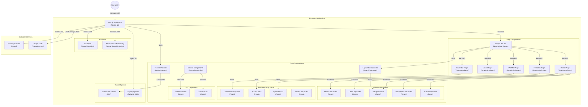

```mermaid
graph TB
    User((End User))

    subgraph "Frontend Application"
        direction TB
        NextApp["Next.js Application<br>(Next.js 14)"]
        
        subgraph "Page Components"
            Pages["Pages Router<br>(Next.js App Router)"]
            HomePage["Home Page<br>(TypeScript/React)"]
            AboutPage["About Page<br>(TypeScript/React)"]
            CalendarPage["Calendar Page<br>(TypeScript/React)"]
            EpisodesPage["Episodes Page<br>(TypeScript/React)"]
            PoapsPage["POAPs Page<br>(TypeScript/React)"]
        end

        subgraph "Core Components"
            direction TB
            ThemeProvider["Theme Provider<br>(React Context)"]
            LayoutComponents["Layout Components<br>(React/TypeScript)"]
            SharedComponents["Shared Components<br>(React/TypeScript)"]
            
            subgraph "Home Components"
                Hero["Hero Component<br>(React)"]
                LatestEpisodes["Latest Episodes<br>(React)"]
                NavBar["Navigation Bar<br>(React)"]
                NymVpn["Nym VPN Component<br>(React)"]
                Stats["Stats Component<br>(React)"]
            end

            subgraph "Feature Components"
                Calendar["Calendar Component<br>(React)"]
                ClaimPoap["POAP Claim<br>(React)"]
                Episodes["Episodes List<br>(React)"]
                Team["Team Component<br>(React)"]
            end

            subgraph "UI Components"
                CustomButton["Custom Button<br>(React)"]
                CustomCard["Custom Card<br>(React)"]
            end
        end

        subgraph "Theme System"
            MUITheme["Material UI Theme<br>(MUI)"]
            TailwindCSS["Styling System<br>(Tailwind CSS)"]
        end

        subgraph "Analytics"
            VercelAnalytics["Analytics<br>(Vercel Analytics)"]
            SpeedInsights["Performance Monitoring<br>(Vercel Speed Insights)"]
        end
    end

    subgraph "External Services"
        VercelPlatform["Hosting Platform<br>(Vercel)"]
        ImageCDN["Image CDN<br>(daoariwas.xyz)"]
    end

    %% Relationships
    User -->|"Interacts with"| NextApp
    NextApp -->|"Renders"| Pages
    Pages -->|"Renders"| HomePage
    Pages -->|"Renders"| AboutPage
    Pages -->|"Renders"| CalendarPage
    Pages -->|"Renders"| EpisodesPage
    Pages -->|"Renders"| PoapsPage

    NextApp -->|"Uses"| ThemeProvider
    ThemeProvider -->|"Configures"| MUITheme
    NextApp -->|"Styled by"| TailwindCSS

    HomePage -->|"Contains"| Hero
    HomePage -->|"Contains"| LatestEpisodes
    HomePage -->|"Contains"| NavBar
    HomePage -->|"Contains"| NymVpn
    HomePage -->|"Contains"| Stats

    CalendarPage -->|"Uses"| Calendar
    PoapsPage -->|"Uses"| ClaimPoap
    EpisodesPage -->|"Uses"| Episodes

    SharedComponents -->|"Provides"| CustomButton
    SharedComponents -->|"Provides"| CustomCard

    NextApp -->|"Tracks with"| VercelAnalytics
    NextApp -->|"Monitors with"| SpeedInsights
    NextApp -->|"Hosted on"| VercelPlatform
    NextApp -->|"Loads images from"| ImageCDN

    %% Layout relationships
    LayoutComponents -->|"Uses"| NavBar
    Pages -->|"Uses"| LayoutComponents
```